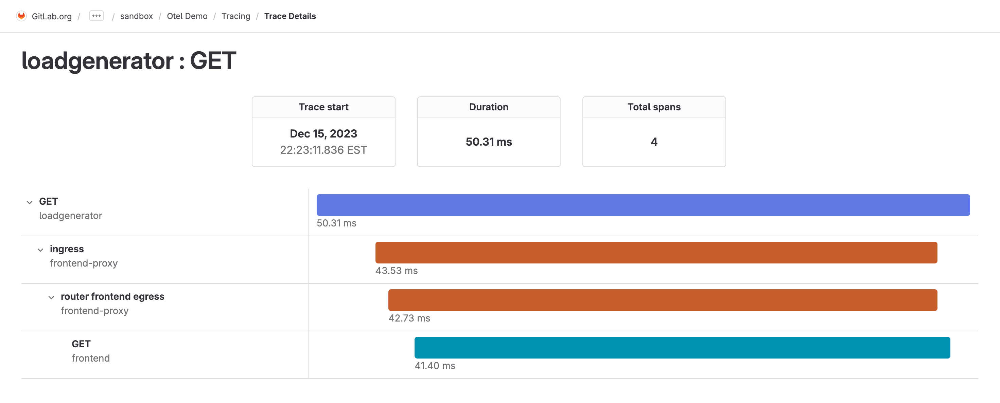

# Distributed tracing

DETAILS:
**Tier:** Ultimate
**Offering:** GitLab.com
**Status:** Beta

> - [Introduced](https://gitlab.com/gitlab-org/gitlab/-/merge_requests/124966) in GitLab 16.2 [with flags](../administration/feature_flags.md) named `observability_group_tab` and `observability_tracing`. Disabled by default. This feature is in [Beta](../policy/experiment-beta-support.md#beta).
> - Feature flag `observability_group_tab` [removed](https://gitlab.com/gitlab-org/gitlab/-/merge_requests/133264) in GitLab 16.5.

FLAG:
On GitLab.com, by default this feature is not available.
To make it available, an administrator can [enable the feature flag](../administration/feature_flags.md) named `observability_tracing`.
The feature is not ready for production use.

With distributed tracing, you can troubleshoot application performance issues by inspecting how a request moves through different services and systems, the timing of each operation, and any errors or logs as they occur. Tracing is particularly useful in the context of microservice applications, which group multiple independent services collaborating to fulfill user requests.

This feature is in [Beta](../policy/experiment-beta-support.md). For more information, see the [group direction page](https://about.gitlab.com/direction/analytics/observability/). To leave feedback about tracing bugs or functionality, comment in the [feedback issue](https://gitlab.com/gitlab-org/opstrace/opstrace/-/issues/2590) or open a [new issue](https://gitlab.com/gitlab-org/opstrace/opstrace/-/issues/new).

## Configure distributed tracing for a project

To configure distributed tracing:

1. [Create an access token and enable tracing.](#create-an-access-token-and-enable-tracing)
1. [Configure your application to use the OpenTelemetry exporter.](#configure-your-application-to-use-the-opentelemetry-exporter)

### Create an access token and enable tracing

Prerequisites:

- You must have at least the Maintainer role for the project.

To enable tracing in a project:

1. On the left sidebar, select **Search or go to** and find your project.
1. Select **Settings > Access Tokens**.
1. Create an access token with the following scopes: `read_api`, `read_observability`, `write_observability`.
1. Copy the value of the access token.
1. Select **Monitor > Tracing**.
1. Select **Enable**.

### Configure your application to use the OpenTelemetry exporter

Next, configure your application to send traces to GitLab.

To do this, set the following environment variables:

```shell
OTEL_EXPORTER = "otlphttp"
OTEL_EXPORTER_OTLP_TRACES_ENDPOINT = "https://observe.gitlab.com/v3/<namespace-id>/<gitlab-project-id>/ingest/traces"
OTEL_EXPORTER_OTLP_TRACES_HEADERS = "PRIVATE-TOKEN=<gitlab-access-token>"
```

Use the following values:

- `namespace-id`: The top-level namespace ID where your project is located.
- `gitlab-project-id`: The project ID.
- `gitlab-access-token`: The access token you [created previously](#create-an-access-token-and-enable-tracing).

When your application is configured, run it, and the OpenTelemetry exporter attempts to send
traces to GitLab.

## View your traces

If your traces are exported successfully, you can see them in the project.

To view the list of traces:

1. On the left sidebar, select **Search or go to** and find your project.
1. Select **Monitor > Traces**.

To see the details of a trace, select it from the list. You can also select a trace directly from the scatterplot.


The trace details page and a list of spans are displayed.



To view the attributes for a single span, select it from the list.


## Tracing ingestion limits

Tracing ingests a maximum of 102,400 bytes per minute.
After the limit is exceeded, a `429 Too Many Requests` response is returned.

To request a limit increase to 104,8576 bytes per minute, contact GitLab support.

## Data retention

GitLab has a retention limit of 30 days for all traces.
