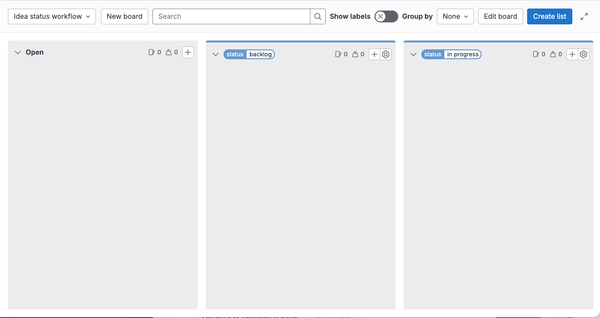
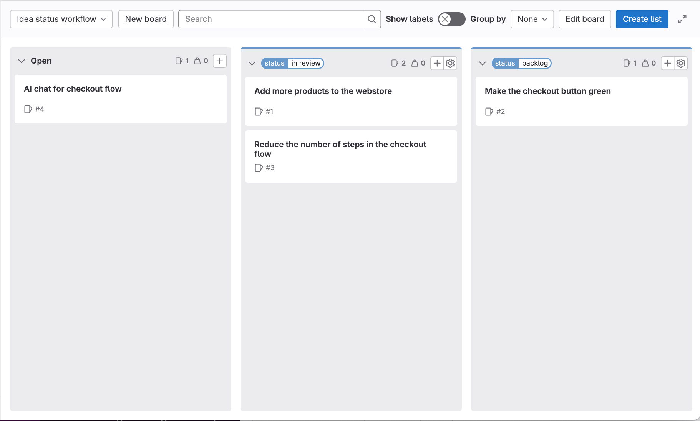

# Tutorial: Set up a project for idea management

DETAILS:
**Tier:** Free, Premium, Ultimate
**Offering:** SaaS, self-managed

<!-- vale gitlab.FutureTense = NO -->

Idea management refers to the collection, organization, evaluation, and implementation of ideas
within an organization or community.
Ideas can originate from various stakeholders, such as employees, customers, or partners.

A separate idea backlog allows the team to capture and prioritize potential concepts and suggestions
before they're fully fleshed out.
Having this separate backlog enables efficient management of raw ideas.
It does so without cluttering the main backlog with unrefined or not validated concepts.

In this tutorial, you'll learn how to set up a GitLab project for idea management.

To set up GitLab for idea management in a project:

1. [Create a project](#create-a-project)
1. [Define the idea workflow](#define-the-idea-workflow)
1. [Document your criteria](#document-your-criteria)
1. [Create scoped labels](#create-scoped-labels)
1. [Create an idea status board](#create-an-idea-status-board)
1. [Stakeholders submit and vote on ideas](#stakeholders-submit-and-vote-on-ideas)
1. [Triage new ideas](#triage-new-ideas)

## Before you begin

- If you're using an existing project for this tutorial, make sure you have at least the Reporter role
  for the project.
- If you follow the steps below and later decide to create a
  parent group for your project, to make
  best use of labels, you'll have to promote the project labels to group labels.

## Create a project

A project contains the issues that will be used to track ideas.

To create a blank project:

1. On the left sidebar, at the top, select **Create new** (**{plus}**) and **New project/repository**.
1. Select **Create blank project**.
1. Enter the project details.
   - For **Project name**, enter `Idea management tutorial`.
1. Select **Create project**.

## Define the idea workflow

Next, you'll need to determine the **status workflow** that ideas will follow.
Communicating the status of an idea helps set the correct expectations with stakeholders.

For this tutorial, suppose you've decided on the following status workflow:

- `In Review`
- `Backlog`
- `In Progress`
- `Complete`
- `Rejected`

## Document your criteria

After you agree on the status workflow, write it all down somewhere your team mates can always access.

For example, add it to a [wiki](../../user/project/wiki/index.md) in your project, or your company
handbook published with [GitLab Pages](../../user/project/pages/index.md).

<!-- Idea for expanding this tutorial:
     Add steps for [creating a wiki page](../../user/project/wiki/index.md#create-a-new-wiki-page). -->

## Create scoped labels

DETAILS:
**Tier:** Premium, Ultimate
**Offering:** SaaS, self-managed

Next, you'll create labels to add to ideas to represent the status workflow.

The best tool for this is [scoped labels](../../user/project/labels.md#scoped-labels), which you
can use to set mutually exclusive attributes.

Checking with the list of statuses you've assembled
[previously](#define-the-idea-workflow), you'll want to create matching
scoped labels.

The double colon (`::`) in the name of a scoped label prevents two labels of the same scope being
used together.
For example, if you add the `status::backlog` label to an issue that already has `status::in review`, the
previous one is removed.

NOTE:
Scoped labels are available in the Premium and Ultimate tier.
If you're on the Free tier, you can use regular labels instead.
However, they aren't mutually exclusive.

To create each label:

1. On the left sidebar, select **Search or go to** and find your project.
1. Select **Manage > Labels**.
1. Select **New label**.
1. In the **Title** field, enter the name of the label. Start with `status::in review`.
1. Optional. Select a color by selecting from the available colors, or enter a hex color value for
   a specific color in the **Background color** field.
1. Select **Create label**.

Repeat these steps to create all the labels you'll need:

- `status::backlog`
- `status::in progress`
- `status::complete`
- `status::rejected`

## Create an idea status board

To prepare for the incoming ideas, create an [issue board](../../user/project/issue_board.md) that organizes ideas by label.
You'll use it to quickly create issues and add labels to them by dragging cards to various lists.

To set up your issue board:

1. On the left sidebar, select **Search or go to** and find your
   **Idea management tutorial** project.
1. Select **Plan > Issue boards**.
1. In the upper-left corner of the issue board page, select the dropdown list with the current board name.
1. Select **Create new board**.
1. In the **Title field**, enter `Idea status workflow`.
1. Keep the **Show the Open list** checkbox selected and clear the **Show the Closed list** one.
1. Select **Create board**. You should see an empty board.
1. Create a list for the `status::in review` label:
   1. In the upper-left corner of the issue board page, select **Create list**.
   1. In the column that appears, from the **Value** dropdown list, select the `status::in review` label.
   1. Select **Add to board**.
1. Repeat the previous step for labels `status::backlog`, `status::in progress`, `status::complete`, and `status::rejected`.

For now, the lists in your board should be empty. Next, you'll populate them with some issues.

## Stakeholders submit and vote on ideas

Share your idea management project with stakeholders and invite them to document their ideas!

To invite your stakeholders:

1. On the left sidebar, select **Manage > Members**
1. Select **Invite members**
1. Type your stakeholders email address.
1. Select **Reporter** role.

Your stakeholders can now access your project to create new ideas:

1. On the left sidebar, select **Plan > Issues**
1. On the top right, select **New issue**
1. Enter a title and description.
1. Select **Create issue**

Stakeholders can also upvote an existing idea to signal that they are interested in an idea:

1. On the left sidebar, select **Plan > Issues**.
1. Select an issue.
1. Select the **Thumbs up** [emoji reaction](../../user/emoji_reactions.md) under the issue description.

## Triage new ideas

Try it out by dragging some issues from the **Open** list to one of the label lists to set the workflow status.

## Next steps

Next, you can:

- Create an [issue template](../../user/project/description_templates.md) to gather all the important
  details from your stakeholders.
- Use [comments and threads](../../user/discussions/index.md) to gather more information about an idea.
- [Relate](../../user/project/issues/related_issues.md) issues in your team backlog to issues in your
  idea project.
