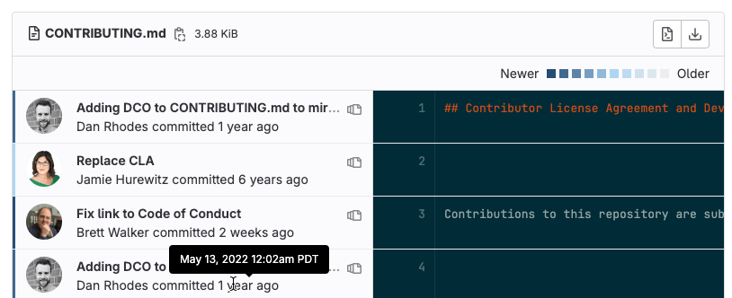

# Git file blame **(FREE ALL)**

[Git blame](https://git-scm.com/docs/git-blame) provides more information
about every line in a file, including the last modified time, author, and
commit hash.

## View blame for a file

Prerequisites:

- The file type must be text-based. The GitLab UI does not display
  `git blame` results for binary files.

To view the blame for a file:

1. On the left sidebar, select **Search or go to** and find your project.
1. Select **Code > Repository**.
1. Select the file you want to review.
1. In the upper-right corner, select **Blame**, and go to the line you want to see.

When you select **Blame**, this information is displayed:



To see the precise date and time of the commit, hover over the date. The vertical bar
to the left of the user avatar shows the general age of the commit. The newest
commits have a dark blue bar. As the age of the commit increases, the bar color
changes to light gray.

### View blame directly in the file view
<!--
When `graphql_git_blame` feature flag is removed,
delete this section and update the steps in "View blame for a file".
-->

> - [Introduced](https://gitlab.com/gitlab-org/gitlab/-/issues/430950) in GitLab 16.7 [with flags](../../../administration/feature_flags.md) named `graphql_git_blame` and `highlight_js_worker`. Enabled by default.
> - Feature flag `highlight_js_worker` [removed](https://gitlab.com/gitlab-org/gitlab/-/issues/432706) in GitLab 16.9.

FLAG:
On self-managed GitLab, by default this feature is available.
To hide the feature, an administrator can [disable the feature flag](../../../administration/feature_flags.md) named `graphql_git_blame`.
On GitLab.com, this feature is available.

When this feature is enabled, you can additionally view blame for a file directly from the file page.

To do so:

1. On the left sidebar, select **Search or go to** and find your project.
1. Select **Code > Repository**.
1. Select the file you want to review.
1. In the file header, select **Blame**, and go to the line you want to see.

### Blame previous commit

To see earlier revisions of a specific line:

1. On the left sidebar, select **Search or go to** and find your project.
1. Select **Code > Repository**.
1. Select the file you want to review.
1. In the upper-right corner, select **Blame**, and go to the line you want to see.
1. Select **View blame prior to this change** (**{doc-versions}**)
   until you've found the changes you're interested in viewing.

## Associated `git` command

If you're running `git` from the command line, the equivalent command is
`git blame <filename>`. For example, if you want to find `blame` information
about a `README.md` file in the local directory:

1. Run this command `git blame README.md`.
1. If the line you want to see is not in the first page of results, press <kbd>Space</kbd>
   until you find the line you want.
1. To exit out of the results, press <kbd>Q</kbd>.

The `git blame` output in the CLI looks like this:

```shell
58233c4f1054c (Dan Rhodes           2022-05-13 07:02:20 +0000  1) ## Contributor License Agreement
b87768f435185 (Jamie Hurewitz       2017-10-31 18:09:23 +0000  2)
8e4c7f26317ff (Brett Walker         2023-10-20 17:53:25 +0000  3) Contributions to this repository are subject to the
58233c4f1054c (Dan Rhodes           2022-05-13 07:02:20 +0000  4)
```

The output includes:

- The SHA of the commit.
- The name of the committer.
- The date and time in UTC format.
- The line number.
- The contents of the line.

## Related topics

- [Git file blame REST API](../../../api/repository_files.md#get-file-blame-from-repository).
